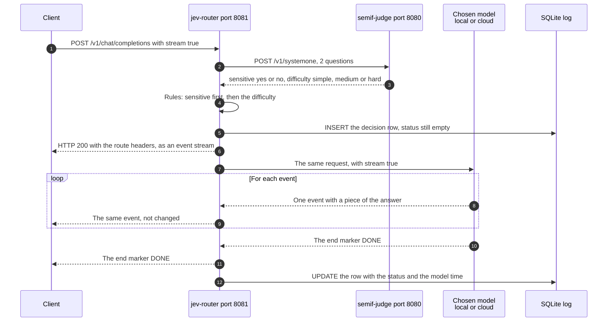
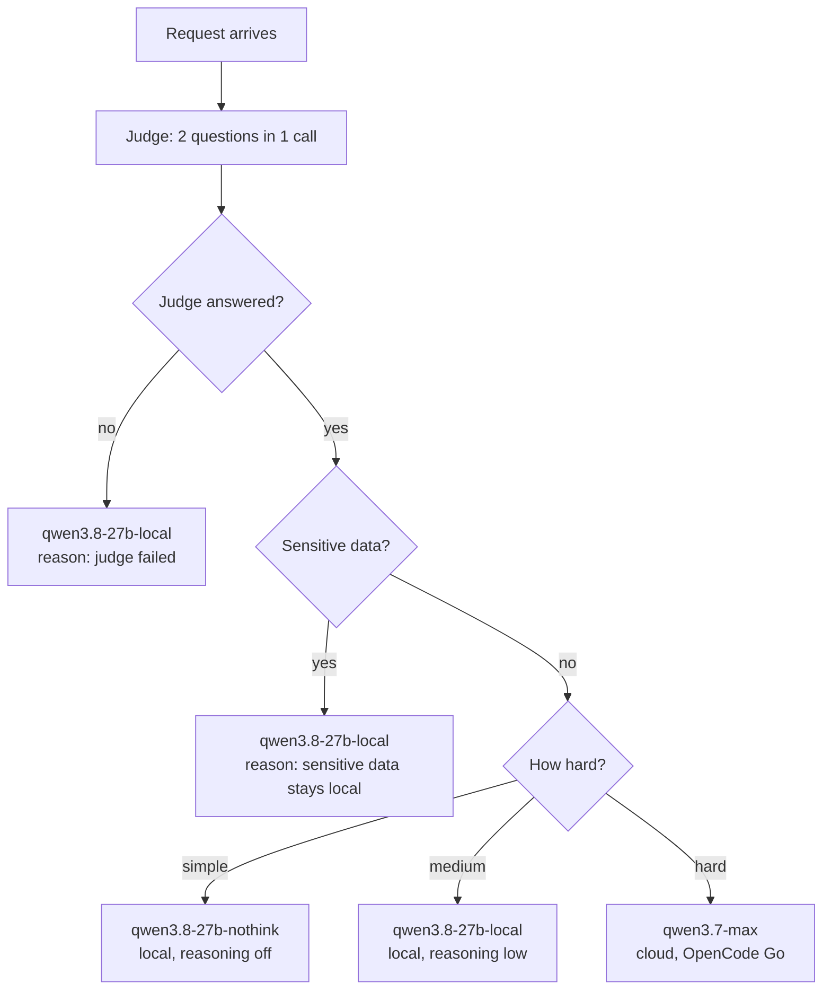
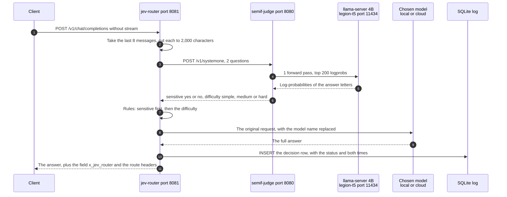

# Proof of concept: a Jev-style router with a local judge

Stage 1, live since 2026-09-23. The plan and the decisions are in `../docs/07-poc-router-plan.md`.
The router is separate from the gateway on LXC 109. It calls the model backends directly.

## Endpoints

| URL | What |
|---|---|
| `http://<POC_IP>:8081/` | The web page with the decision log. It refreshes every 10 seconds |
| `http://<POC_IP>:8081/v1/chat/completions` | The OpenAI-compatible endpoint. Any model name works, because the router picks the model. `stream: true` works |
| `http://<POC_IP>:8081/api/decisions` | The log as JSON |
| `http://<POC_IP>:8081/health` | The state of the judge and of each target |
| `http://<POC_IP>:8080/v1/systemone` | The judge, in the TypeSafe Jev shape |

There is no authentication. Use it on the LAN only.

## How one request runs

1. The router takes the last 8 messages, and it cuts each message to 2,000 characters.
2. It asks the judge 2 questions in one call: sensitive data (yes or no), and the difficulty (simple, medium or hard).
3. The judge runs the SemIf readout on Qwen3.5-4B: one forward pass, then softmax over the answer letters.
4. The rules pick the model. The sensitivity rule runs first, so sensitive data never goes to the cloud.
5. The router sends the original request to that model, and it writes the decision to SQLite.
6. The answer carries the route: an extra field `x_jev_router` in a normal answer, and the response headers in a stream.

### Streaming

`stream: true` works since 2026-09-23. The router passes every event through, and it adds nothing to the stream. The route travels in the response headers:

| Header | Example |
|---|---|
| `x-jev-route` | `qwen3.7-max` |
| `x-jev-reason` | `difficulty hard` |
| `x-jev-sensitive` | `false` |
| `x-jev-difficulty` | `hard` |
| `x-jev-judge-seconds` | `0.594` |

The log row goes into SQLite before the first event, because the route is known then. The status and the model time go into the row when the stream ends.



The client gets the route before the first word of the answer, because the headers come first. The router adds no event of its own. On an error, it sends 1 event with an `error` field, and it writes that error into the log row.


Measured: the judge takes 0.60 s on average for both questions, with the 4B model. The comparison of the 2B, 4B and 9B models is in `results/README.md`.

### The rules as a diagram



The order matters. The sensitivity check runs first, so a hard question with personal data stays local.

### A normal request, step by step



A judge failure does not break the request. The router then takes the fallback model `qwen3.8-27b-local`, and it writes the reason into the log row.

## Parts

| Part                                                 | Where                                        | Port  |
| ---------------------------------------------------- | -------------------------------------------- | ----- |
| Judge model, Qwen3.5-9B Q4_K_M                       | legion-t5, llama-server, 5,932 MiB VRAM      | 11434 |
| Container `semif-judge`                              | LXC 110 `jev-poc`, <POC_IP>             | 8080  |
| Container `jev-router`                               | LXC 110                                      | 8081  |
| Target `qwen3.8-27b-nothink` and `qwen3.8-27b-local` | gaming-b650                                  | 11434 |
| Target `qwen3.7-max`                                 | OpenCode Go, `https://opencode.ai/zen/go/v1` | -     |

## Files

| File | What |
|---|---|
| `judge/app.py` | The judge service. It wraps `../semif-test/remote_semif.py` |
| `judge/Dockerfile` | Python 3.13, `transformers` 5.17.0, SemIf at commit `1f2dea3`. No torch. The tokenizer is baked in, so the container needs no internet |
| `router/app.py` | The router: the decision code, the proxy, the SQLite log, and the web page |
| `router/router.yaml` | The 2 judge questions, the rules, and the 3 targets |
| `router/Dockerfile` | Python 3.13, FastAPI, httpx |
| `docker-compose.yml` | Both containers. The build context is the repo root |
| `tests.sh` | 7 test examples as a shell script: 5 normal requests and 2 stream requests |
| `run_tests.py` | The same 7 examples, with a check of the route and a result file |
| `judge_cases.jsonl` | 24 judge cases with the wanted answers |
| `judge_bench.py` | The judge bench: it asks only the judge, without an answer model |
| `switch_judge.sh` | It switches the judge model between 2B, 4B and 9B |
| `results_table.py` | It builds the comparison tables from the result files |
| `results/` | The result files, the tables, and `results/README.md` with the comparison |
| `provision-hosts.sh` | It creates LXC 110 with Docker, and it installs the NVIDIA container toolkit on legion-t5. `check` reports the state of both hosts |
| `laya/` | The Laya judge on legion-t5, with its own README and deploy script |
| `decision-fork/` | The llama.cpp fork with the `/v1/decision` endpoint: the CUDA build, the deploy script and the live security test |
| `decision-judge/` | The judge on the fork endpoint `/v1/decision`. It runs on LXC 110, port 8085 |
| `needle/` | Needle 3 of Cactus Compute: research, the plan, and a draft service. **Still to do: install and test** |

## Rebuild

Time: about 30 minutes, and most of that is the image build.

1. Make sure the judge model runs on legion-t5.
   `ssh legion bash semif-test/serve-model.sh /opt/models/qwen3.5-9b-standard.gguf qwen3.5-9b /opt/llama.cpp 11434`
   The embed and rerank services must stay stopped. They need the same GPU memory.
2. Create the LXC on pve2, and install Docker. One command does both:
   ```sh
   ./provision-hosts.sh lxc110
   ```
   For the Laya judge on the legion GPU, also run `./provision-hosts.sh legion-gpu`. That
   installs the NVIDIA container toolkit and writes the CDI spec.
3. Copy `poc/` and `semif-test/remote_semif.py` to `/opt/jev-poc-src/` on the LXC.
4. Write the cloud key into `/opt/jev-poc-src/poc/.env` as `OPENCODE_GO_API_KEY=...`. gopass is the source. Never put the key in a repo file.
5. Build and start.
   `cd /opt/jev-poc-src/poc && docker compose up -d --build`
6. Run the tests from the workstation.
   `./tests.sh`

## Test result, 2026-09-23

| # | Example | Judge | Route | Correct |
|---|---|---|---|---|
| 1 | "What is the capital of France?" | simple 1.00, sensitive no | `qwen3.8-27b-nothink` | yes |
| 2 | A bash one-liner plus an explanation | medium 0.98, sensitive no | `qwen3.8-27b-local` | yes |
| 3 | The design of a fault-tolerant job queue | hard 1.00, sensitive no | `qwen3.7-max` (cloud) | yes |
| 4 | A mortgage file with a name and an IBAN, plus a hard question | hard 1.00, sensitive yes 1.00 | `qwen3.8-27b-local` | yes |
| 5 | A birthday line for a named person at an address | simple 1.00, sensitive yes 1.00 | `qwen3.8-27b-local` | yes |

| 6 | The same simple question with `stream: true` | simple, sensitive no | `qwen3.8-27b-nothink`, 11 events in 2 s | yes |
| 7 | A hard design question with `stream: true` | hard, sensitive no | `qwen3.7-max`, 1,683 events in 75 s | yes |

Every stream ended with `[DONE]` and carried the route headers. Give a stream test at least 900 seconds. A long cloud answer of 5,000 tokens or more needs more than 300 seconds, and a shorter timeout cuts the stream.

## Judge model

The judge is Qwen3.5-4B Q4_K_M. It reads 23 of 24 bench cases the way we want. Qwen3.5-9B reads 22 of 24 and is 47 % slower. Qwen3.5-2B reads 12 of 24, because it calls almost every request hard. Laya multilingual, an encoder model on the CPU, reads 4 of 24. The full comparison is in `results/README.md`.

A second judge needs no router change. Each judge speaks the same `/v1/systemone` shape, and `judge_bench.py --judge <url>` measures any of them.

## Known limits

- One judge. When legion-t5 stops, every request falls back to `qwen3.8-27b-local`.
- No authentication, and no rate limit.
- The web page shows the model time only after the stream ends. During a stream, that column stays empty.
- The sensitivity check is a model answer, not a guarantee. Test it against your own data before you trust it.
- The judge sees the last 8 messages, cut to 2,000 characters. That text stays inside your network.
